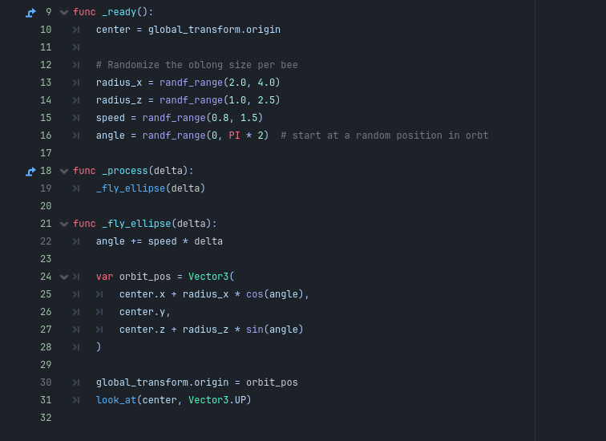
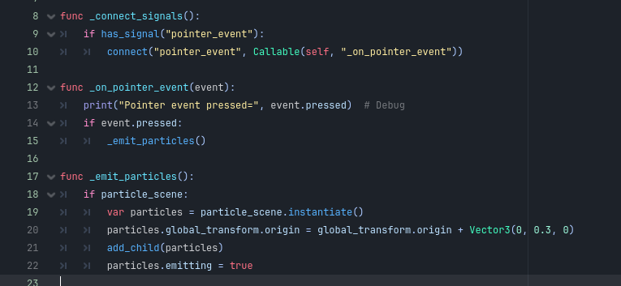
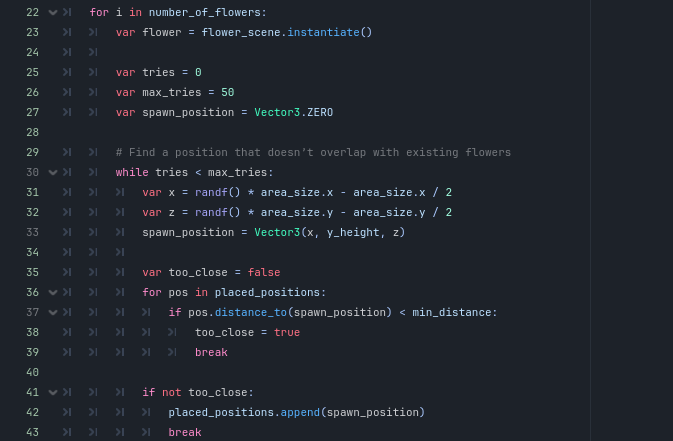
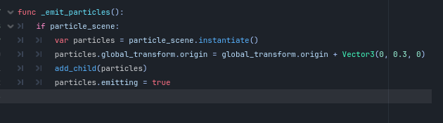
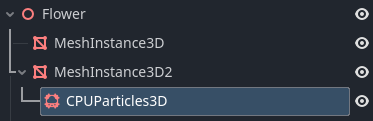

# PollenXR

Manar Saighi

C21440946

TU858/4

[Github](https://github.com/manarsaighi)

# Video

# Screenshots

# Description of the project

This project is a simple VR experience based on the sustainable development goal "Life on Land". Pollination is crucial for life on the planet and bees are essential pollinators. Without bees, the world would suffer dramatically.

This project consists of a simple "pollination" interaction. The small flower field scene consists of 30 procedurally generated daisies and several bee models flying around. The pollination event is achieved through a click and is depicted using particle effects with a low gravity setting to simulate pollen scattering about.

# Instructions for use

The experience consists of a single interaction. Users can move around the flower field and click on flowers to trigger a pollen particle effect.

# Code Snippets

The bee code uses cos(angle) and sin(angle) multiplied by different radii to create different sized oblongs for the bees to fly along.

The flower code consists of a pointer event that allows it to register input from a user. The emit_particls method then instantiates the CPUparticles into the scene.

The flower manager is in charger of procedural generation of the flowers. From here you can control the amount of flowers spawned, how far apart they spawn from each other, and where they spawn on the y-axis.

# References

Bee model: https://www.cgtrader.com/free-3d-models/animals/insect/low-poly-flying-bee

Bee Buzzing sounds effect: https://pixabay.com/sound-effects/bee-flying-loop-42287/

Background Music: https://opengameart.org/content/underwater-theme

# What I am most proud of in the assignment

I'm most proud of getting the click event to trigger the pollen particles as well as the procedural generation. 

For procedural generation, some issues I encountered were the flowers all spawning at the origin (0,0) on the ground (i.e where the player spawns). There were also issues with the flowers spawing closely together. To fix this I added parts to the script that set a minimum distance apart from each flower. I also used random values within the defined area to stop the flowers from spawning in one place.

# What I learned

Procedural Generation: I learned how to procedurally generate my flower models onto a set area. Every time the scene is reloaded, flowers spawn in dynamic locations.

Particles: I learned about CPU particles and GPU particles. CPU particles were chosen here because the animation is simple and I wanted an option that minimises latency. 

Gravity: I learned about the different effects of gravity on the CPU particles. I settled on a -0.5 gravity level on the y axis to creata a slow fall effect, like pollen scattering to the ground from a flower.

Creating Models: I created a simple flower model using 3D meshes in Godot. I learned that too many meshes cause lag as Godot tries to render many copies of meshes per model. I used Blender to combine petal meshes together as a single mesh, reducing mesh amounts significantly (8x30 meshes to 1x30 meshes). 

Importing Models: I imported a low poly bee model from a free 3D models website. I learned that models come as .obj files.

Working with Blender: I used Blender for the first time with this assignment to colour the bee models I imported. I learned that .mtl files work strangely in Godot and this was easier.

XRTools: I learned to use XRTools. The XRtools plugin addons were helpful for movement. I also set up the Meta XR Simulator as a fallback, as my laptop had trouble connecting to headset.

# Proposal submitted earlier:

https://github.com/manarsaighi/pollenXR